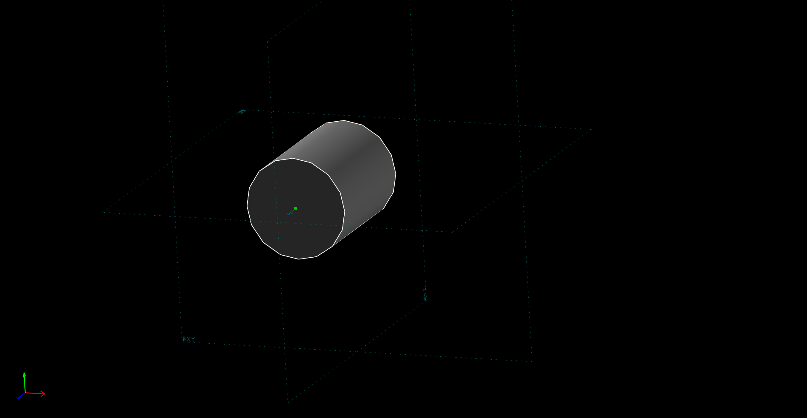
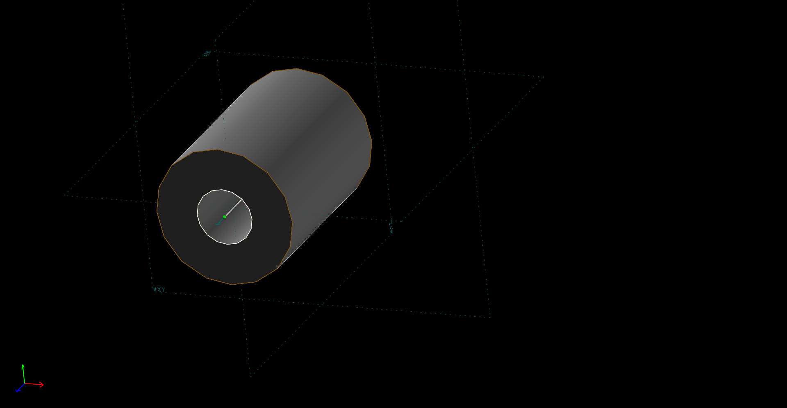
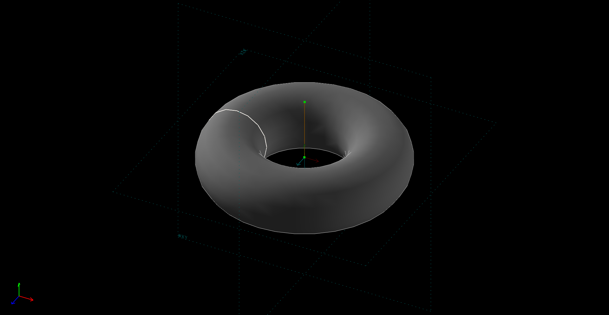

Title: 40423116_11/24
Date: 2016-11-24 12:00
Category: 作業
Tags: WiKi
Author: 40423116

W11

<!-- PELICAN_END_SUMMARY -->

## Solvespace

### 1. Parts (零件繪製)

範例檔案: <a href="http://solvespace.com/bracket.pl">http://solvespace.com/bracket.pl</a>

An introductory tutorial is available, in which we draw the same part that is shown in the demo video. 

This covers most of the basic features of SolveSpace, including sketches, constraints, extrusions, and Boolean operations.

When we first run SolveSpace, we will begin with an empty part. Initially, our view of the part will be oriented onto the XY plane; the label for that plane is displayed at the bottom left of the screen (#XY, in dark grey). The axes are also indicated by the three colored arrows at the bottom left; the X, Y, and Z axes are drawn in red, green, and blue respectively.

When we hover the mouse over any entity, constraint, or other object in the sketch, that object will appear highlighted in yellow. For example, the XY plane, which is drawn as a dashed square, will appear highlighted when we hover the mouse over it. The YZ and ZX planes initially look like dashed lines, because they are being viewed on edge; but they still appear highlighted in yellow when we hold the mouse over them. It is similarly possible to highlight the X, Y, and Z axes (which are drawn as arrows), or the origin (which like all points is drawn as a green square).

#### Extrude (平行長出或除料)

STL 格式

範例:平行長出

<iframe src="./../w11/40423116.html"width="800" height="600"></iframe>

STL 格式

範例:除料

<iframe src="./../w10/40423116_2.html"width="800" height="600"></iframe>

#### Lathe (旋轉繞行長出或除料)

#### Export Triangle Mesh

STL 格式

three.js

<iframe src="./../w10/40423116_3.html" width="800" height="600"></iframe>

