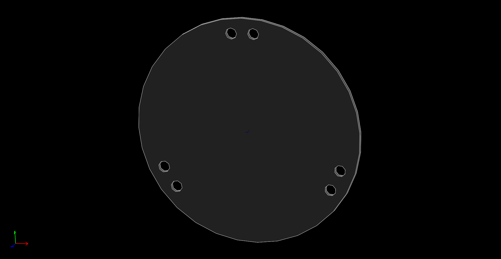
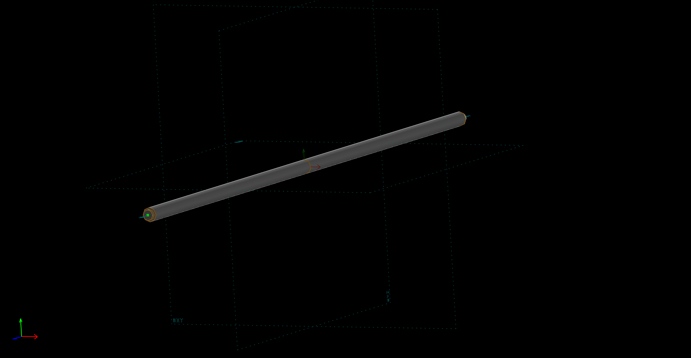
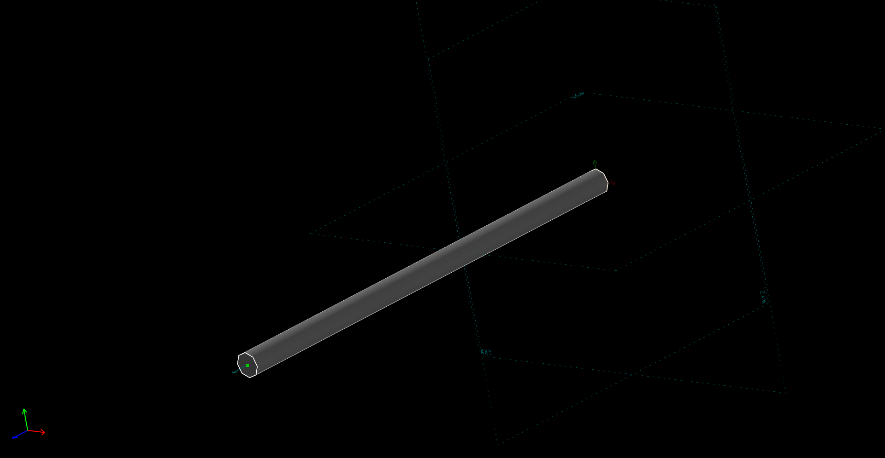
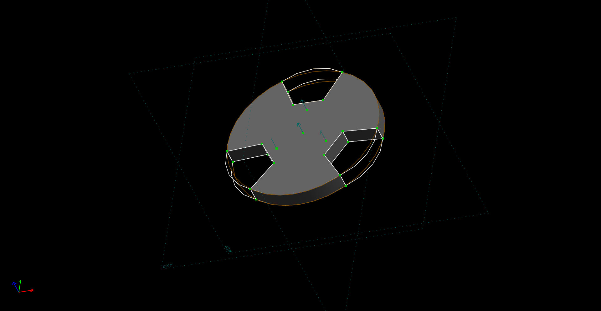
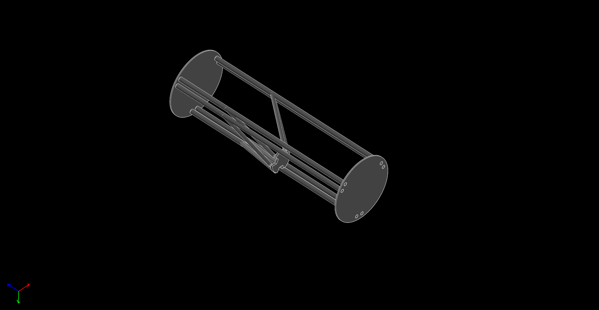

Title: 40423116 12/15
Date: 2016-12-15 12:00
Category: 作業
Tags: WiKi
Author: 40423116

W14 Solvespace 3D列印機組裝

<!-- PELICAN_END_SUMMARY -->

Solvespace 零件

## Solvespace 組合圖

<iframe src="./../w14/40423116_w14.html" width="800" height="600"></iframe>

<iframe src="https://player.vimeo.com/video/196683898" width="640" height="360" frameborder="0" webkitallowfullscreen mozallowfullscreen allowfullscreen></iframe>

<a href="https://vimeo.com/196683898">3D列印機</a> from <a href="https://vimeo.com/user47573583">40423116</a> on <a href="https://vimeo.com">Vimeo</a>.
