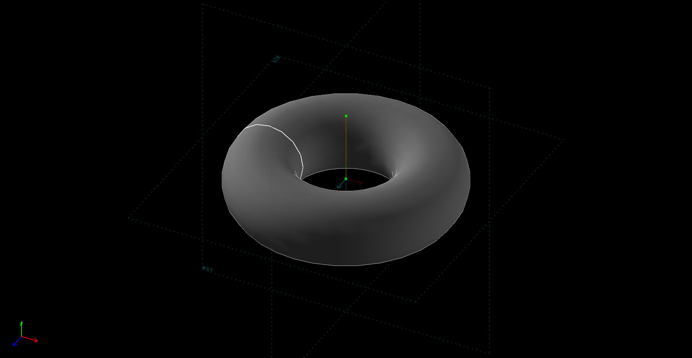
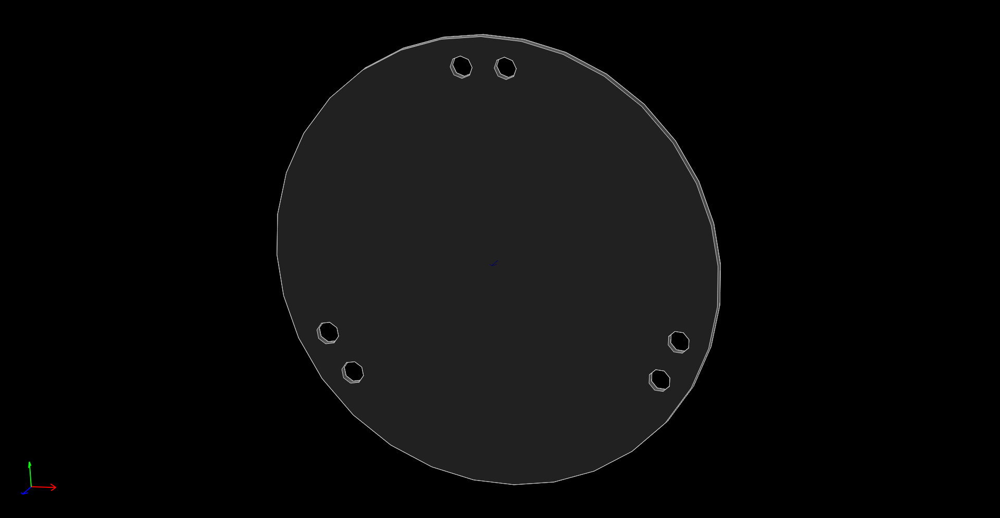
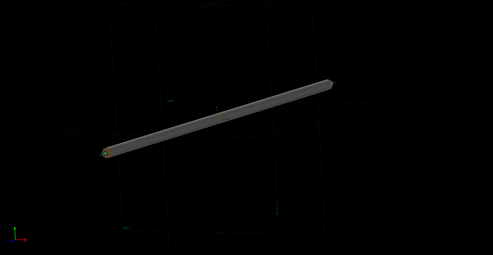
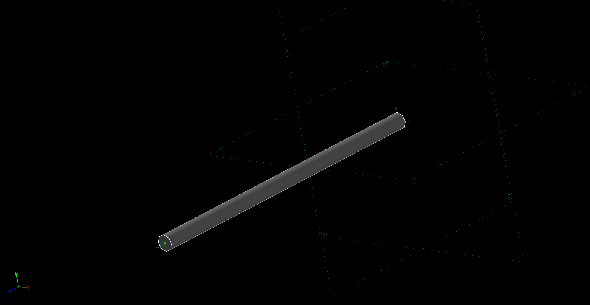
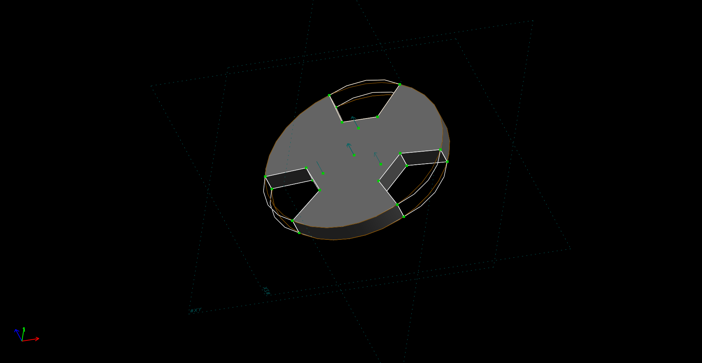

Title: 電腦輔助設計實習 課程總結
Date: 2017-1-12 12:00
Category: 作業
Tags: WiKi
Author: 40423116

 課程總結

<!-- PELICAN_END_SUMMARY -->

###四連桿運動路徑

<iframe src="https://player.vimeo.com/video/199434983" width="800" height="600" frameborder="0" webkitallowfullscreen mozallowfullscreen allowfullscreen></iframe>

<a href="https://vimeo.com/199434983">四連桿運動路徑</a> from <a href="https://vimeo.com/user46450524">40423116</a> on <a href="https://vimeo.com">Vimeo</a>.

Solvespace 四連桿圖檔:

<a href="./../w10/40423116.csv">40423116.csv</a>

<a href="./../w10/40423116-w10-4.slvs">40423116-w10-4.slvs</a>

##利用brython繪運動路徑####
<!-- 導入 brython.js -->

<!-- 啟動 brython() -->

<!-- 以下利用 Brython 程式執行繪圖 -->

<canvas id="fourbar" width="600" height="600"></canvas>

## Solvespace

### 1. Parts (零件繪製)

範例檔案: <a href="http://solvespace.com/bracket.pl">http://solvespace.com/bracket.pl</a>

An introductory tutorial is available, in which we draw the same part that is shown in the demo video. 

This covers most of the basic features of SolveSpace, including sketches, constraints, extrusions, and Boolean operations.

When we first run SolveSpace, we will begin with an empty part. Initially, our view of the part will be oriented onto the XY plane; the label for that plane is displayed at the bottom left of the screen (#XY, in dark grey). The axes are also indicated by the three colored arrows at the bottom left; the X, Y, and Z axes are drawn in red, green, and blue respectively.

When we hover the mouse over any entity, constraint, or other object in the sketch, that object will appear highlighted in yellow. For example, the XY plane, which is drawn as a dashed square, will appear highlighted when we hover the mouse over it. The YZ and ZX planes initially look like dashed lines, because they are being viewed on edge; but they still appear highlighted in yellow when we hold the mouse over them. It is similarly possible to highlight the X, Y, and Z axes (which are drawn as arrows), or the origin (which like all points is drawn as a green square).

###簡易長出、除料、旋轉長料

<iframe src="https://player.vimeo.com/video/199435381" width="800" height="600" frameborder="0" webkitallowfullscreen mozallowfullscreen allowfullscreen></iframe>

<a href="https://vimeo.com/199435381">2017 01 14 17 53 31 199</a> from <a href="https://vimeo.com/user46450524">40423116</a> on <a href="https://vimeo.com">Vimeo</a>.

#### Extrude (平行長出或除料)

STL 格式

範例:平行長出

<iframe src="./../w11/40423116.html"width="800" height="600"></iframe>

STL 格式

範例:除料

<iframe src="./../w11/40423116_2.html"width="800" height="600"></iframe>

#### Lathe (旋轉繞行長出或除料)

#### Export Triangle Mesh

<iframe src="./../w11/40423116_3.html" width="800" height="600"></iframe>

###練習零件繪製

<iframe src="https://player.vimeo.com/video/185673835" width="800" height="600" frameborder="0" webkitallowfullscreen mozallowfullscreen allowfullscreen></iframe>

<a href="https://vimeo.com/185673835">練習零件繪製</a> from <a href="https://vimeo.com/user47573583">40423116</a> on <a href="https://vimeo.com">Vimeo</a>.

##Solvespace 組合件繪圖

###Solvespace 組合圖

<iframe src="./../w12/40423116_W12.html" width="800" height="600"></iframe>

<iframe src="https://player.vimeo.com/video/199436815" width="800" height="600" frameborder="0" webkitallowfullscreen mozallowfullscreen allowfullscreen></iframe>

<a href="https://vimeo.com/199436815">組合教學</a> from <a href="https://vimeo.com/user46450524">40423116</a> on <a href="https://vimeo.com">Vimeo</a>.

###Solvespace 3D列印機 自製 零件

###Solvespace 3D列印機 組合圖

<iframe src="./../w14/40423116_w14.html" width="800" height="600"></iframe>

<iframe src="https://player.vimeo.com/video/196683898" width="800" height="600" frameborder="0" webkitallowfullscreen mozallowfullscreen allowfullscreen></iframe>

<a href="https://vimeo.com/196683898">3D列印機</a> from <a href="https://vimeo.com/user47573583">40423116</a> on <a href="https://vimeo.com">Vimeo</a>.

##Onshape 3D列印機組裝
###3D印表機組裝p1:底部跟頂部組裝
<iframe width="800" height="600" src="https://www.youtube.com/embed/AutytuVWHjM" frameborder="0" allowfullscreen></iframe>
###3D印表機組裝p2:框架與控制器組裝
<iframe width="800" height="600" src="https://www.youtube.com/embed/YH20-IHWWwI" frameborder="0" allowfullscreen></iframe>
###3D印表機組裝p3:滑軌的組裝
<iframe width="800" height="600" src="https://www.youtube.com/embed/U1WD80UzMas" frameborder="0" allowfullscreen></iframe>
###3D印表機組裝p4:噴頭座與連桿組裝
<iframe width="800" height="600" src="https://www.youtube.com/embed/TgjGrrfuu-E" frameborder="0" allowfullscreen></iframe>

##機械設計工程系-電腦輔助設計實習課程: cadpb_w16
###影片
<iframe width="800" height="600" src="https://www.youtube.com/embed/DPDlHe8mV70" frameborder="0" allowfullscreen></iframe>