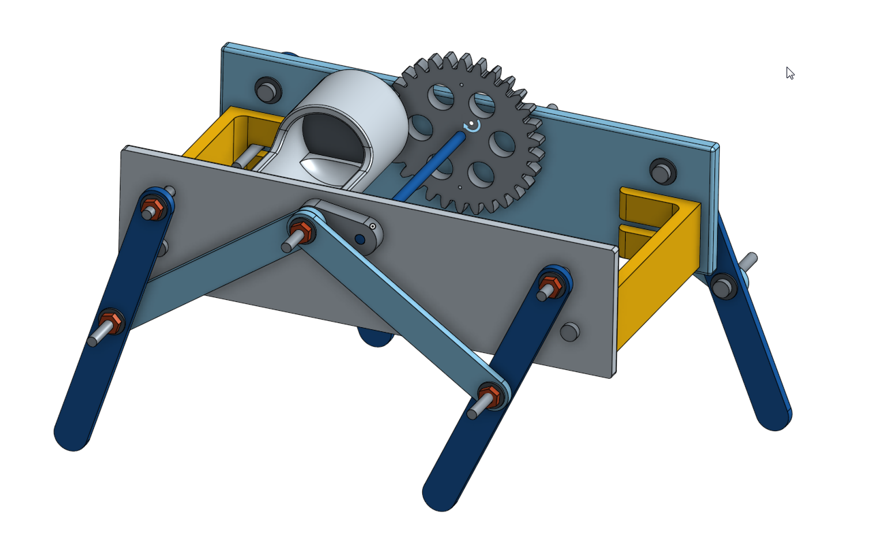

Title: 四連桿行走機構
Date: 2017-06-16 12:15
Category: 2017springcd_hw
Tags: 作業
Author: 40423116

<!-- PELICAN_END_SUMMARY -->

###組合、零件圖

配件為M3螺帽、M3螺絲、圓墊片及直流馬達
零件:
連接件x2
兩側連接腳之板件
四連桿腳組2、4、4(短桿、長桿、腳)

###onshape 運動
<iframe src="https://player.vimeo.com/video/223092787" width="640" height="360" frameborder="0" webkitallowfullscreen mozallowfullscreen allowfullscreen></iframe>

<a href="https://vimeo.com/223092787">40423116 onshape 行走機構運動</a> from <a href="https://vimeo.com/user47573583">40423116</a> on <a href="https://vimeo.com">Vimeo</a>.

<a href="https://cad.onshape.com/documents/7113275b196c13ba2a4f1cdf/w/09ad642ae3484329c5fbdf4e/e/ecc8f7f70622951f76dbfe55">onshape</a>

###實物運動
<iframe src="https://player.vimeo.com/video/222340552" width="640" height="356" frameborder="0" webkitallowfullscreen mozallowfullscreen allowfullscreen></iframe>

<a href="https://vimeo.com/222340552">40423116-2017springcd-final-6.mp4</a> from <a href="https://vimeo.com/user47573583">40423116</a> on <a href="https://vimeo.com">Vimeo</a>.

因直流馬達扭力不足，所以在陸地行走不實際

##下載
<a href="./../data/w17/40423116_fourbarcar.stl">四連桿零件組</a>

<a href="./../data/w17/40423116_fourbarcar01.stl">四連桿組合件</a>

